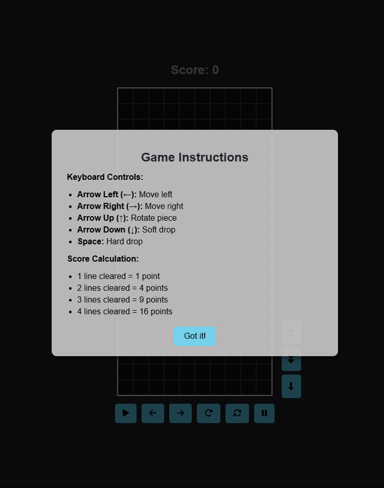
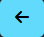
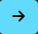
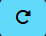

# Tetris Like Game

## How to play

- ### Game Instruction Modal

    When you first open the index.html or visit the [github page](https://walkingmen666.github.io/), you will get a screen like below.  
    

    As the img show. You can use keyboard to control Tetromino.

    | Key             | Move       |
    | --------------- | ---------- |
    | Arrow Left (←)  | Move left  |
    | Arrow Right (→) | Move right |
    | Arrow Up (↑)    | Rotate     |
    | Arrow Down (↓)  | Soft Drop  |
    | Space           | Hard Drop  |

    **Score:** The number of cleared lines squared.

    ***

    After you understand the game instruction, Click the `Got it!` button to close the modal.  
    > 
    Now, you should see few buttons on the screen.  
    Here are the function of these buttons.  
    |Key                                            |Function   |  
    |-----------------------------------------------|-----------|
    |         |Game Start |
    |          |Move Left  |
    |         |Move Right |
    |        |Rotate     |
    |       |Restart    |
    |         |Pause      |
    |      |Speed Up   |
    |    |Speed Down |
    |     |Hard drop  |

    ***

- ### Game Start

    1. Click  button.
    2. `2024` fly through game screen.
    3. **Game Start!!**
    >
    - Note:
        - Once you click `Pause` button, click `Start` or `Pause` again to restart the game.
        - You can drag the Tetromino to any proper position but not above itself.
        - Previous Tetromino will hard drop when new Tetromino spawn. Which means you can't control it anymore.

## Self-Grade 

Finish Percentage: **100%**

- [x] 1. HTML UI Elements: `10%`
  - [x] a. HTML Canvas
  - [x] b. Buttons: Start, Left, Right, Rotate, Reset, Pause
  - [x] c. Design your own blocks and game panels, UIs.
- [x] 2. 5 Tetris Blocks and numbers `10%`
  - [x] a. Except the above 5 blocks, create blocks “2024” for opening animation
  - [x] b. Use random gradient color to fill each unit of a block, examples are shown
        below.
  - [x] c. The block has three statuses: alive, alive and selected, dead (cannot be selected).
- [x] 3. Animation `15%`
  - [x] a. Opening animation: flying 2024, appear and disappear (moving to a direction) 5%
  - [x] b. Tetris block animation: 10%
    - Randomly create one of the 5 Tetris blocks, and make it appear at the
      top of the game area.
    - Automatically Move 1 unit downward each second.
    - The next block will be created after 5 sec.
    - Use two buttons to adjust the speed (+/-)
- [x] 4. Each Block can detect the collision of each other. `25%`
  - [x] a. The bottom and the two sides of the game area are the boundaries that blocks
        cannot go through. 5%
  - [x] b. Blocks cannot go through (penetrate) each other. (i.e., you cannot move the
        block to somewhere it cannot go through.). 20%
  - [x] c. The block stops moving when its bottom reach the bottom of the canvas or hit
        other dead blocks. The block’s status is then set to dead.
- [x] 5. Interactive game control with the buttons and mouse: `30%`
  - [x] a. Start/Pause/Reset button. 5%
  - [x] b. Left: move the selected block to the left 2%
  - [x] c. Right: move the selected block to the right. 2%
  - [x] d. Rotate: rotate the selected blocks 90 degree clockwise. 3%
  - [x] e. You can use mouse to select which alive block you would like to control 15%
    - Only blocks which are not dead yet can be selected.
    - The block is selected if the mouse clicked inside the block.
    - The selected block will move (dragged) along the mouse until the
      mouse is released.
  - [x] f. The selected block should be highlighted with a red bold bounding box. 3%
- [x] 6. The game is over when the block died at a place higher than the ceiling. Show... `5%`
- [x] 7. Code and document readability: write comments and organize your code properly. `5%`
